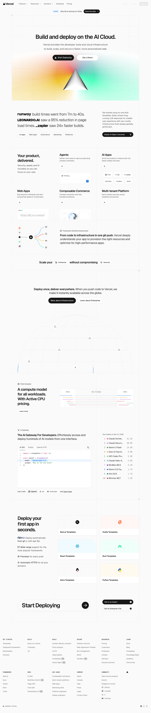
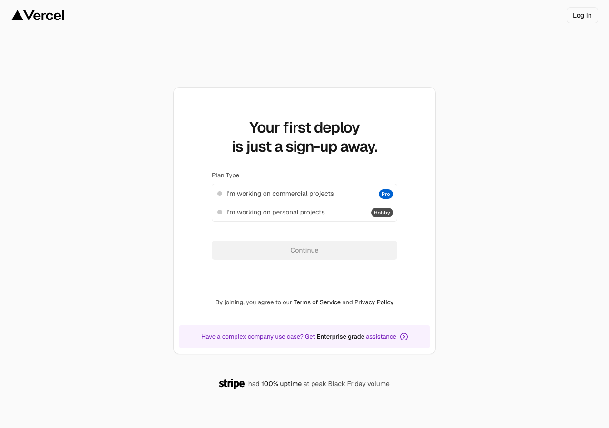
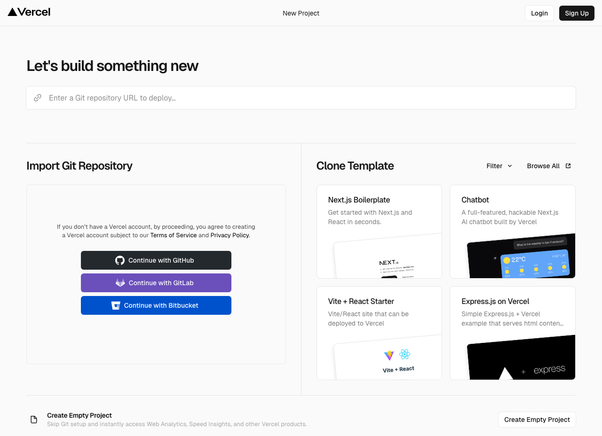
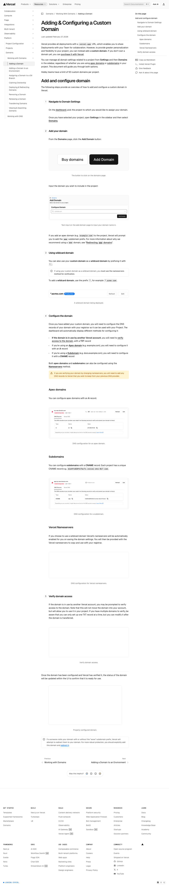
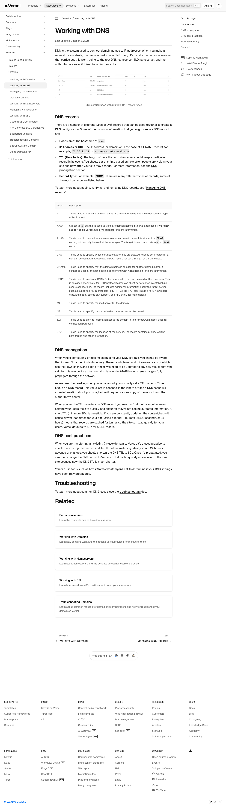
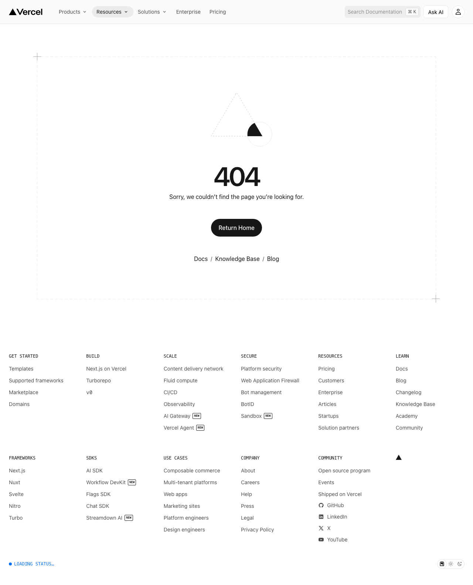

# How to Deploy a Website on Vercel with a Custom Domain

> URL: https://vercel.com

---

### Step 1: Create Vercel Account and Connect GitHub

🎙️ *"First, we'll set up your Vercel account and connect it to your GitHub repository. This enables automatic deployments whenever you push code changes. Having your code on GitHub is essential for Vercel's seamless integration."*

▶️ **Action:** Go to vercel.com, click 'Sign up' in the top right corner, choose your plan type, enter your name, then click 'Continue with GitHub' to link your accounts

---

### Step 2: Import and Deploy Your Project

🎙️ *"Now we'll import your GitHub repository into Vercel and create your first deployment. Vercel automatically detects your framework and configures the build settings. This gives you a working website with a vercel.app domain."*

▶️ **Action:** Click 'New Project', select 'Import Git Repository', choose your GitHub repository, configure framework settings if needed, then click 'Deploy'

---

### Step 3: Navigate to Domain Settings

🎙️ *"With your project deployed, it's time to add your custom domain. The domain settings allow you to connect your purchased domain name to your Vercel project. Make sure you own the domain you want to connect."*

▶️ **Action:** Go to your project dashboard, click on 'Settings' in the navigation menu, then click on 'Domains' in the sidebar

---

### Step 4: Add Your Custom Domain

🎙️ *"Here you'll enter your custom domain name that you purchased from a domain registrar like Namecheap or GoDaddy. Vercel supports both apex domains and subdomains. The system will guide you through the verification process."*

▶️ **Action:** Click the 'Add' button, enter your custom domain name (e.g., yourdomain.com), then click 'Add' again to confirm

---

### Step 5: Configure DNS Settings

🎙️ *"Vercel will now show you the DNS configuration needed to connect your domain. You have options to use Vercel's nameservers or add specific DNS records. The nameserver method is often simpler for beginners."*

▶️ **Action:** Click on 'Nameservers' tab, then click 'Enable Vercel DNS', copy the provided nameserver addresses

---

### Step 6: Update Domain Registrar Settings

🎙️ *"Now you'll configure your domain registrar to point to Vercel's servers. This step happens outside of Vercel, on your domain provider's website. The exact interface varies by provider, but the process is similar across all registrars."*

▶️ **Action:** Log into your domain registrar (Namecheap, GoDaddy, etc.), find your domain management page, locate 'Nameservers' or 'DNS' settings, select 'Custom DNS', paste the Vercel nameservers, then save changes

---

### Step 7: Verify Domain and Enable HTTPS

🎙️ *"Return to Vercel to complete the setup process. DNS changes can take up to 48 hours to propagate globally, but usually work within minutes. Vercel automatically provides SSL certificates for secure HTTPS access once verification is complete."*

▶️ **Action:** Go back to Vercel domains page, click 'Verify' next to your domain, wait for verification to complete (this may take a few minutes), then your site will be live at your custom domain with automatic HTTPS

---

*ShowMe AI — 2026-03-21*