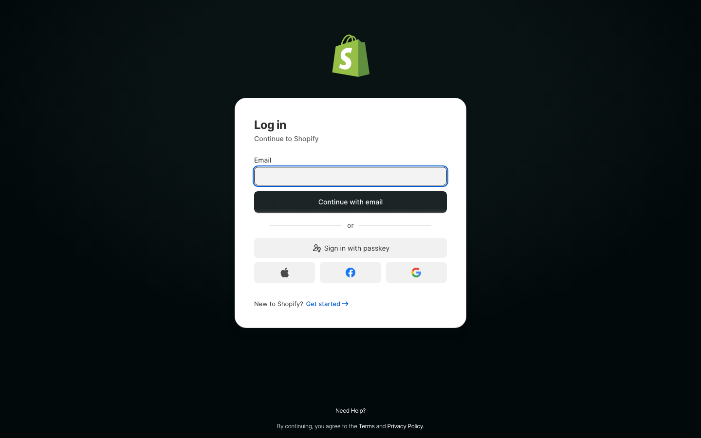
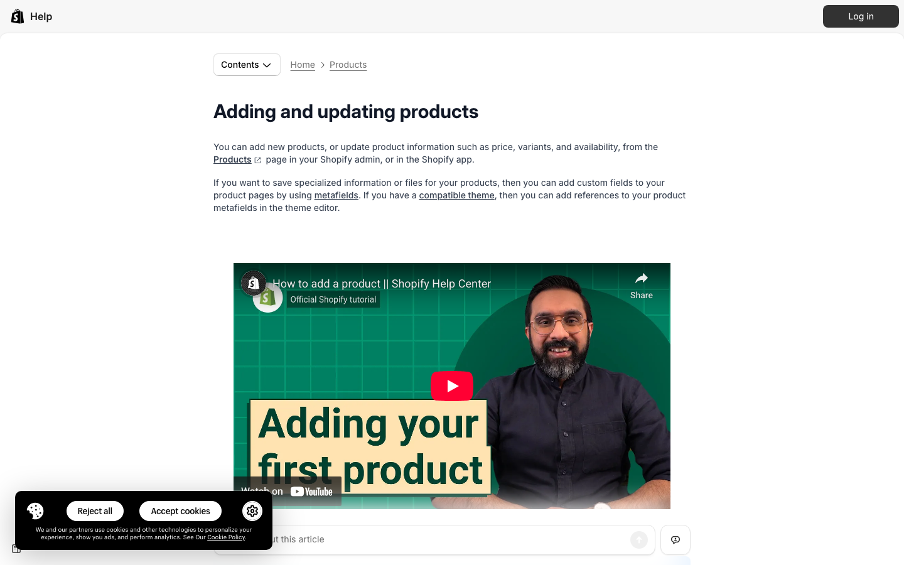
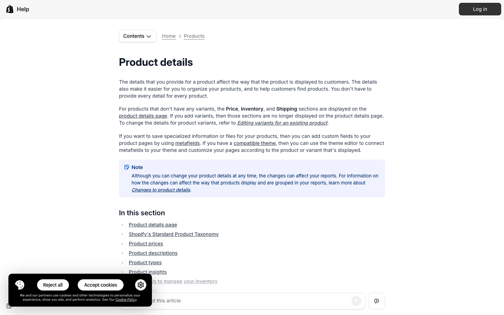
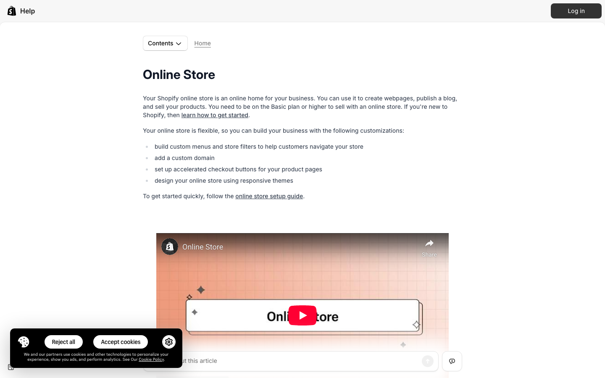

# How to Set Up a Shopify Store and Add Your First Product

> URL: https://www.shopify.com

---

### Step 1: Create Your Shopify Account

🎙️ *"Start your e-commerce journey by signing up for a free Shopify trial. <cite index="12-8,12-9">Head over to Shopify's free trial page and click on 'Start free trial' and follow the prompts.</cite> <cite index="12-10,12-11">You'll need to provide some basic information, including a valid email address, a password and your store name. Your chosen store name becomes your domain name or My Shopify URL (yourstorename.myshopify.com).</cite>"*

▶️ **Action:** Visit shopify.com, click 'Start free trial', enter email address and password, choose unique store name

---

### Step 2: Complete Business Information Setup

🎙️ *"After creating your account, Shopify will guide you through essential business details setup. <cite index="12-17,12-18">Shopify will ask you a few questions about your business, including what you plan to sell and your business address. Providing accurate business details helps with tax calculations and shipping setups.</cite> This information helps customize your store experience and ensures proper legal compliance."*

▶️ **Action:** Fill out business questionnaire with store description, address, and product type information, then click 'Save and continue'

---

### Step 3: Navigate to Your Admin Dashboard

🎙️ *"Once your account is set up, you'll access the Shopify admin dashboard - your store's control center. <cite index="11-8,11-9">From your account, you can explore your Shopify admin dashboard, the control center for your ecommerce business. Click through the vertical menu on the left-hand side to familiarize yourself with the dashboard's key features.</cite> This is where you'll manage all aspects of your online business."*

▶️ **Action:** Explore the left sidebar menu, click through sections like Products, Orders, and Settings to familiarize yourself with the interface

---

### Step 4: Add Your First Product

🎙️ *"<cite index="11-11,11-12">Select "Products" in the left side of your browser window. Choose "Add product" to navigate to the products section of the admin dashboard.</cite> This is where you'll create detailed product listings that will appear in your store. <cite index="4-8">The first step towards managing an eCommerce store is to create your first product.</cite>"*

▶️ **Action:** Click 'Products' in left menu, then click 'Add product' button (purple button at top)

---

### Step 5: Fill in Product Details

🎙️ *"<cite index="11-13">Input your first product title and description, upload images, and add pricing information.</cite> <cite index="4-26,4-27">Your product's description is the best way to explain and sell your product to your target audience and grab their attention. Shopify has provided a rich text editor so you can customize your description.</cite> Include all essential details like SKU, inventory tracking, and product categories."*

▶️ **Action:** Enter product title, write compelling description using rich text editor, upload high-quality product images, set price, add weight/dimensions, enable inventory tracking

---

### Step 6: Configure Product Organization

🎙️ *"Organize your product properly for better store management and customer discovery. <cite index="13-25,13-26,13-27">As soon as you enter your product, Shopify's AI Magic will suggest a suitable product category for you. This not only saves time but also helps keep your catalog organized from the start. You can stick with the suggestion or choose a different category if it's a better fit.</cite> Add relevant tags and set product availability."*

▶️ **Action:** Select product type/category, add descriptive tags separated by commas, set product availability and sales channels, configure SEO settings

---

### Step 7: Set Product Status and Publish

🎙️ *"<cite index="5-25,5-26">Before publishing it, select the active option in the status section to make it visible on your website. However, if you're not yet ready to publish it, select draft.</cite> <cite index="8-17,8-18">Once you're ready to publish your first product, go to the top right corner of the screen where you can change its status from draft to active. Believe it or not, that's all you need to do to add your first product!</cite>"*

▶️ **Action:** Change status from 'Draft' to 'Active' in top right corner, select sales channels (Online Store), choose target markets, click 'Save' to publish your product

---

### Step 8: Verify Your Product is Live

🎙️ *"After publishing, it's important to verify that your product appears correctly in your store. <cite index="1-18">You can preview how a product will display on your online store directly from your Shopify admin or the Shopify app.</cite> This ensures customers can find and purchase your product successfully."*

▶️ **Action:** Click 'View your store' in top right corner to preview your live store, navigate to your product page, test the display and functionality

---

*ShowMe AI — 2026-03-21*