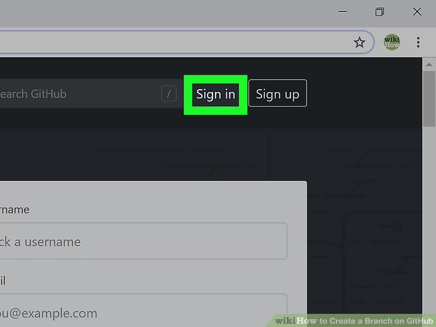
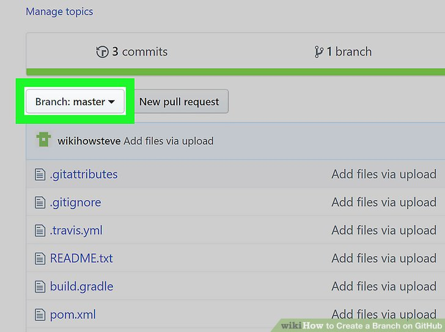
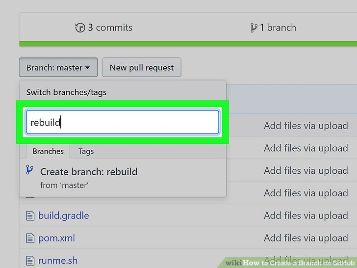
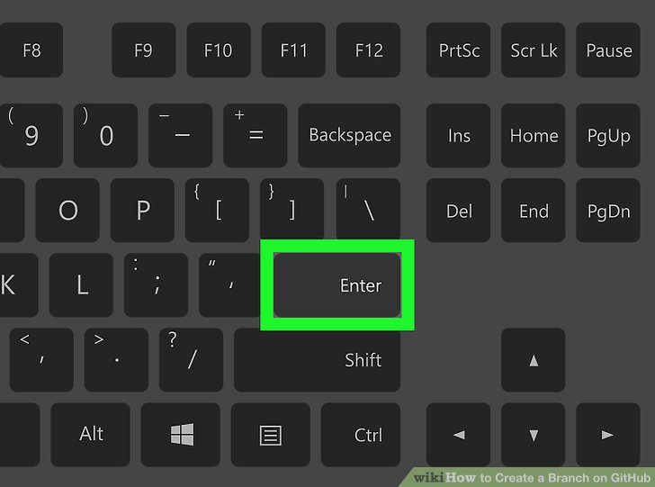

# How to create a GitHub repository

> URL: https://github.com

> Source: [WikiHow — Create a Branch on GitHub](https://www.wikihow.com/Create-a-Branch-on-GitHub)

---

### Step 1: Sign in to GitHub

🎥 [Watch video](videos/step-01.mp4)

🎙️ *"Enter your credentials and click sign in to access GitHub."*

---

### Step 2: Click New Repository

🎥 [Watch video](videos/step-02.mp4)

🎙️ *"Find and click the green 'New' button on your dashboard."*

---

### Step 3: Enter Repository Name

🎥 [Watch video](videos/step-03.mp4)

🎙️ *"Type a unique name for your new repository."*

---

### Step 4: Configure Repository Settings

🎥 [Watch video](videos/step-04.mp4)

🎙️ *"Choose visibility, add description, and select initialization options."*

---

### Step 5: Create Repository

🎥 [Watch video](videos/step-05.mp4)

🎙️ *"Click the green 'Create repository' button to finish setup."*

---

*ShowMe AI — 2026-03-21*